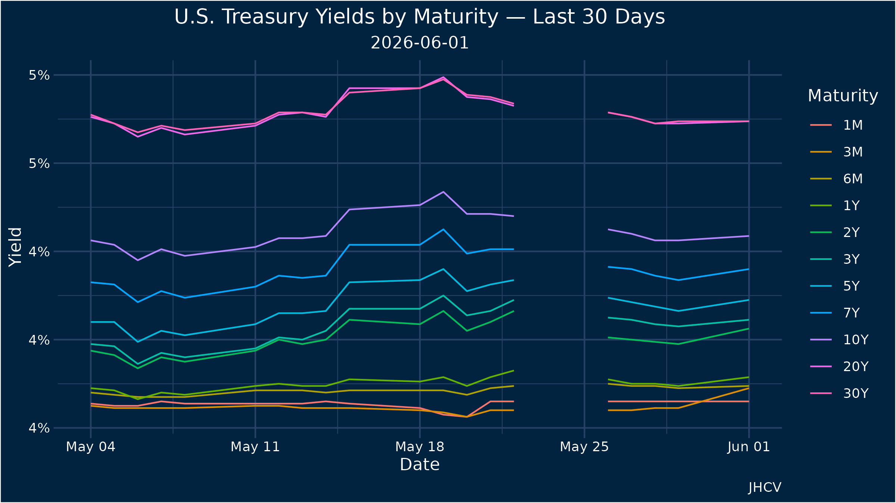

# Discord Bot

There are many discord bots but this one is mine. I love it dearly.

Built so I could send a message from my phone and have it run scripts, pull data, and post results back to the server - even if I'm not at the helm. Runs on a Raspberry Pi. Speaks Python and R.

**183 commits · 18,000+ lines · March 2025 - present**

---

## tech stack

- **Python** (discord.py) - slash command handling, data fetching, ESPN/MLB/NHL APIs
- **R** (ggplot2, gganimate) - all chart and plot generation
- **Raspberry Pi** (aarch64, systemd service) - always-on host

---

## commands

### `/weather`
| command | description |
|---|---|
| `today` | current conditions + forecast for Jacksonville, FL |
| `tomorrow` | tomorrow's forecast |
| `jaxradar` | NWS KJAX radar GIF |
| `jaxsat` | satellite GIF of Jacksonville, FL |
| `flradar` | radar GIF for the entire state |
| `usradar` | continental US radar GIF |
| `hurricane` | NOAA 7-day tropical weather outlook |
| `alerts` | active NWS alerts for northeast Florida |

### `/surf`
| command | description |
|---|---|
| `surf` | 1-week surf forecast plot for Jax Beach, FL |
| `wavemap` | wave height forecast map GIF |
| `windmap` | wind speed & direction forecast map GIF |
| `buoy waves` | wave height plot from NOAA NDBC buoy #41117 off St. Augustine |
| `tide plot` | tide forecast for Mayport Bar Pilots Dock |

### `/ball`
One command. All sports. Returns today's (or tomorrow's) schedule and scores across NHL, MLB, NBA, PGA, and NFL in a single multi-embed response.

### `/nhl`
| command | description |
|---|---|
| `today` | today's NHL games |
| `tomorrow` | tomorrow's NHL games |

### `/cats`
Florida Panthers content - next game, scores, 2024 Stanley Cup content, rat celebrations, and more.

### `/nfl`
Next game info and Jaguars-specific commands under `/jags`.

### `/nba`
| command | description |
|---|---|
| `today` | today's NBA games |
| `tomorrow` | tomorrow's NBA games |

### `/pga`
| command | description |
|---|---|
| `tournament` | live leaderboard for the current PGA Tour event |
| `standings` | season FedEx Cup standings |

### `/mlb`
| command | description |
|---|---|
| `today` | today's MLB schedule with live/final scores |
| `tomorrow` | tomorrow's schedule |
| `compare` | sabermetric head-to-head for 2-4 players (stream score + roster score) |
| `lineup` | start/sit card for your fantasy roster with scoring signals |
| `pickup` | scans the full FA pool, surfaces top 3 batter + pitcher adds |
| `fantasystandings` | World Sillies league standings |
| `fantasyscoreboard` | current week matchups |
| `fantasyroster` | your roster |
| `fantasyfa` | free agent pool |
| `gmscore` | grades every manager's decisions from last week (A+ to F) |
| `hotcold` | hottest and coldest batters + pitchers in the last 7 days |
| `playertrends` | recent scoring trend chart for a player |
| `whohits` | best historical hitters vs today's probable pitchers |
| `mismatch` | batter vs pitcher matchup OPS from 5 years of Statcast data |
| `fantasyrisk` | risk flags across your roster (injury, cold streak, bad matchup) |
| `zonemap` | pitch location subplots by pitch type for any pitcher |

### `/f1`
Next race info.

### `/markets`
| command | description |
|---|---|
| `chart` | price chart for any stock ticker |
| `fedrate` | fed funds target rate history |
| `yieldcurve` | latest US Treasury yield curve |
| `yieldspread` | 10Y-2Y spread history (2mo or full) |
| `crudeoil` | WTI crude oil price chart |
| `trades` | recent trade chart |
| `fear` | CNN Fear & Greed Index |
| `movers` | top market gainers and losers |
| `earnings` | upcoming earnings (7 days) or earnings history for a ticker |
| `options` | options flow for a ticker |
| `short` | most shorted stocks |
| `crypto` | price chart for BTC, ETH, SOL, or DOGE |
| `forecast` | GJR-GARCH / EGARCH / SARIMA animated forecast GIF with Monte Carlo paths |

### `/space`
| command | description |
|---|---|
| `nextlaunch` | next launch from Kennedy Space Center, Cape Canaveral, FL |
| `isspass` | upcoming ISS passes visible from Jacksonville, FL |

### `/jaxcams`
Live traffic camera grid from FL511 - searchable by location name (Dames Point, Fuller Warren, etc).

### `/jaxplanes`
Plot of active aircraft within 150nm of KJAX.

### `/jaxships`
Maritime traffic map for the St. Johns River and Jacksonville port.

### `/osrs`
Old School RuneScape hiscores lookup.

### `/dj`
Plays music from a Pioneer rekordbox USB library in a voice channel. Supports queue, skip, stop, and playlist browsing by genre or artist.

### `/history`
| command | description |
|---|---|
| `server` | total server message history chart |
| `channel` | per-channel message history |
| `user` | message history for a specific user |
| `daily` | daily message volume plot |
| `invitegraph` | bubble network of who invited who to the server |
| `repograph` | repo growth over time - cumulative lines of code + weekly commits |

### misc
`/ping`, `/duval`, `/westside`, `/ts`, `/goodmorning`, `/dontavius`, `/r2`, `/chucktronic`, `/serversdown`, and a handful of others best discovered in the wild.

---

## sample output

